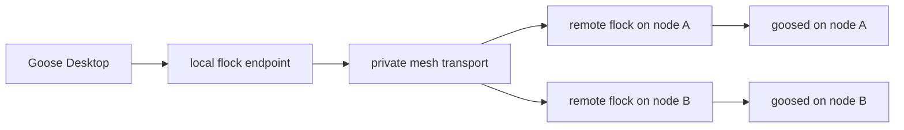

# flock

`flock` routes Goose traffic over a private [`mesh-llm`](https://github.com/michaelneale/mesh-llm) mesh so Goose can run against a remote `goosed` on another machine without Goose needing to understand mesh routing.

The intended user experience is:

- Goose Desktop runs on your laptop
- `goosed` runs on one or more remote machines
- `flock` exposes one stable local backend endpoint to Goose
- `flock` selects a remote node for each new chat
- once created, the chat stays pinned to that node

`flock` is private-mesh-only. It must not advertise or route Goose traffic over public meshes.

## Repository Layout

This repo is a standalone Rust workspace.

Current crate layout:

- `flock`
  - the only binary
  - acts as the local CLI
  - acts as the `mesh-llm` plugin executable when started with `--plugin`

## Current Status

What exists today:

- Rust workspace scaffold
- single `flock` binary
- `flock install`
  - copies the binary into the mesh config directory
  - writes the `[[plugin]]` registration entry
  - backfills `[flock.routing]` defaults in `~/.mesh-llm/config.toml`
- `flock --plugin`
  - runs as a minimal `mesh-llm` plugin
  - is marked private-mesh-only at startup policy level
- initial architecture, config, protocol, and route inventory specs

What is not implemented yet:

- local Goose-facing HTTP endpoint
- remote node advertisement
- `goosed` supervision
- mesh transport for proxied Goose traffic
- session binding and routing

## Commands

Current commands:

- `flock install`
- `flock goose`
- `flock --plugin`

Current behavior:

- `flock install` is usable now
- `flock goose` is a stub
- `flock --plugin` is a skeleton plugin entrypoint, not a full router yet

## Configuration

`flock` reads and writes `~/.mesh-llm/config.toml` by default.

It currently owns:

- a `[[plugin]]` registration entry for `flock`
- a `[flock.routing]` table

Default install shape:

```toml
[[plugin]]
name = "flock"
enabled = true
command = "/Users/<user>/.mesh-llm/flock"
args = ["--plugin"]

[flock.routing]
publish_interval_secs = 5
stale_after_secs = 20
local_port = 43123
working_dir = "/Users/<user>/code"
default_strategy = "balanced"
next_chat_target = ""
default_host_preference = ""
require_healthy_goosed = true
max_cpu_load_pct = 95
max_memory_used_pct = 95
min_disk_available_bytes = 10737418240
weight_rtt = 1.0
weight_active_chats = 15.0
weight_cpu_load = 0.7
weight_memory_used = 0.5
```

If `MESH_LLM_CONFIG` is set, `flock` uses that path instead.

## Design

The current design is:

- Goose talks to one stable local backend URL exposed by local `flock`
- local `flock` is the router
- remote `flock` instances advertise nodes that can front local `goosed`
- new-chat placement happens before pinning
- once a remote `goosed` returns a `session_id`, that session is pinned to the chosen node

Short version:



## V1 Boundary

The current intended v1 target is:

- Goose iOS style capability scope
- implemented on the newer session-based API
- while ensuring Goose Desktop does not visibly break when attached through `flock`

That means v1 is centered on:

- backend health/connectivity
- create session
- resume session
- list sessions
- session-based reply streaming
- cancellation
- minimal provider/config/session sync for usable chats

Broader parity such as full settings UI, schedules, recipes, diagnostics, tunnel/gateway controls, and MCP app parity is deferred.

## Goose Dependency

`flock` currently depends on the Goose session metadata fix in [block/goose#8164](https://github.com/block/goose/pull/8164).

Without that change, freshly created or resumed sessions can report missing provider/model metadata even when the backend has a valid global provider configured, which is visible to external-backend clients like `flock`.

## Specs

Primary docs:

- [Specification](/Users/jdumay/code/flock/specs/flock-spec.md)
- [Implementation Plan](/Users/jdumay/code/flock/specs/implementation-plan.md)
- [Config Schema](/Users/jdumay/code/flock/specs/config-schema.md)
- [Route Inventory](/Users/jdumay/code/flock/specs/route-inventory.md)
- [mesh-llm Protocol Changes](/Users/jdumay/code/flock/specs/mesh-llm-protocol-changes.md)
- [Roadmap](/Users/jdumay/code/flock/ROADMAP.md)

## Development

Build:

```bash
cargo build
```

Default tests stay fast:

```bash
cargo test
```

Opt-in local mesh E2E smoke:

```bash
cargo test local_mesh_e2e -- --ignored --nocapture
```

Opt-in SSH-backed private-mesh E2E:

```bash
FLOCK_SSH_HOST=studio54.local cargo test ssh_private_mesh_e2e -- --ignored --nocapture
```

Local mesh E2E prerequisites:

- local `mesh-llm` binary at `../mesh-llm/target/debug/mesh-llm`
- local `goosed` binary at `../goose/target/debug/goosed`
- local llama.cpp binaries at `../mesh-llm/llama.cpp/build-flock/bin`
- local model `~/.models/Qwen2.5-3B-Instruct-Q4_K_M.gguf`
- the current user can write `/tmp/mesh-llm-llama-server.log`

SSH E2E prerequisites:

- `FLOCK_SSH_HOST` points at a second machine reachable with SSH keys
- the remote machine can run the locally built binaries staged by the test
- the remote machine already has `~/.models/Qwen2.5-3B-Instruct-Q4_K_M.gguf`
- local llama.cpp binaries exist at `../mesh-llm/llama.cpp/build-flock/bin`
- the remote machine can write `/tmp/mesh-llm-llama-server.log`

The SSH E2E stages `mesh-llm`, `flock`, `goosed`, `rpc-server`, and `llama-server` onto the remote machine, runs a private two-node mesh, creates a Goose session through the laptop-side `flock` endpoint, and verifies that the session/reply/events flow completes against the remote node.

Smoke-test install against a temporary config:

```bash
tmpdir="$(mktemp -d)"
MESH_LLM_CONFIG="$tmpdir/config.toml" cargo run -- install
cat "$tmpdir/config.toml"
```
