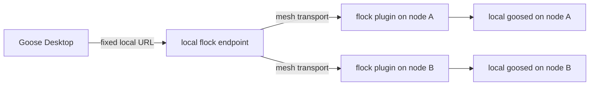
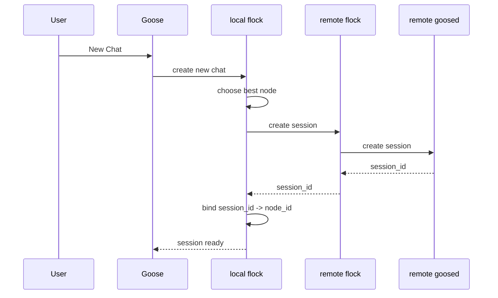

# Flock Specification

## Purpose

`flock` provides remote Goose execution over a private `mesh-llm` mesh.

The goal is:

- Goose Desktop runs on the laptop
- the actual Goose backend work runs on a selected remote node
- the remote node exposes `goosed` locally only
- `flock` tunnels `goosed` traffic over the mesh
- Goose talks to one stable local endpoint, not directly to mesh nodes

`flock` must only operate on private meshes.

It must not:

- advertise `goosed`-backed services on public meshes
- allow Goose routing over public meshes
- act as a public-mesh remote access layer

## Repository Layout

`~/code/flock` is a standalone Rust workspace with one crate:

1. `flock`

`mesh-llm` is not the home for the plugin implementation. `mesh-llm` should only change when protocol-level support is required.

## Crates

### `flock`

`flock` is the only binary.

Responsibilities:

- act as the local CLI
- act as the `mesh-llm` plugin executable when started in plugin mode
- register the plugin in `~/.mesh-llm/config.toml`
- launch Goose against the stable local `flock` endpoint
- later: helper commands for diagnostics, pairing, listing nodes, and selecting defaults
- advertise local `goosed` availability on the mesh when in plugin mode
- supervise a local `goosed` instance when in plugin mode
- tunnel `goosed`-compatible HTTP and SSE traffic over the mesh when in plugin mode
- maintain bindings from Goose sessions to selected remote nodes when in plugin mode

Initial commands:

- `flock install`
- `flock goose`
- `flock --plugin`

There is no separate `flock-plugin` crate or binary.

There is also no separate "host" binary or "client" binary. The same `flock` binary runs everywhere, and its role is determined by local state, startup mode, and the requests being handled.

## High-Level Architecture

Goose talks to a stable local backend URL exposed by the local `flock` plugin instance.

That local plugin instance acts as a router and proxy. It chooses a remote mesh node for each new chat, creates the session there, and pins the resulting Goose session to that node.



## Boundary with Goose

Goose remains largely unchanged.

Goose should continue to use its existing "external backend" support:

- Goose Desktop points to one local backend URL
- Goose sends normal `goosed` API requests
- Goose does not need to know about mesh nodes, tunnels, or routing

This avoids modifying Goose to understand mesh routing or multi-host selection internally.

`flock` is explicitly targeting a **full external-backend experience** for Goose.

That means the local `flock` endpoint should behave like a real external `goosed` backend from Goose’s perspective, not a partial compatibility shim for a narrow subset of routes.

For delivery planning, the intended initial scope is a Goose iOS style capability envelope implemented on the newer session-based API.

So v1 should prioritize:

- create session
- resume session
- list sessions
- session-based reply streaming and cancelation
- the minimum provider/config/session sync needed for normal chat use

Broader desktop parity outside that baseline should be treated as later work and tracked in the roadmap.

## Boundary with `mesh-llm`

`mesh-llm` remains the plugin host and transport substrate.

Expected `mesh-llm` changes should be limited to:

- plugin protocol additions required by `flock`
- host transport improvements needed for streaming HTTP/SSE proxying
- optional plugin runtime hooks if the current protocol cannot carry the needed data-plane traffic cleanly

No `flock` business logic should live inside `mesh-llm`.

`flock` should rely on mesh visibility and refuse operation on public meshes.

## Flock Node Identity

Every advertising `flock` node includes:

- `node_id`: the mesh identity, used for routing and trust
- `hostname`: derived from the machine hostname, used for display
- optional `display_name`: a future user-facing override

Rules:

- routing and affinity bind to `node_id`
- UI should show `hostname`, with short `node_id` as a disambiguator
- `hostname` is presentation only, not authoritative identity

## Advertised Service Record

Each `flock` plugin instance that can front a local `goosed` advertises a service record.

This advertisement is private-mesh only.

Rules:

- advertise only when attached to a private mesh
- do not advertise on public meshes
- if mesh visibility becomes public, withdraw or suppress `flock` service advertisements

Node advertisement is periodic.

Each advertising node should republish its current advertisement at a regular interval so peers can:

- discover newly available `goosed` nodes
- receive fresh hardware, health, and load data
- expire stale nodes when advertisements stop arriving

A practical starting point is:

- publish every 5 to 10 seconds
- expire stale nodes after 3 missed intervals
- treat `last_seen_unix_ms` as the freshness source of truth

Suggested shape:

```json
{
  "service_kind": "goosed",
  "service_version": 1,
  "node_id": "mesh-node-id",
  "hostname": "home-studio",
  "display_name": "home-studio",
  "healthy": true,
  "goosed_available": true,
  "goosed_version": "1.28.0",
  "operating_system": {
    "platform": "macos",
    "version": "15.4",
    "arch": "aarch64"
  },
  "cpu": {
    "model": "Apple M2 Ultra",
    "physical_cores": 24,
    "logical_cores": 24
  },
  "memory": {
    "max_bytes": 137438953472,
    "used_pct": 54.0,
    "available_bytes": 33973862400
  },
  "disk": {
    "estimated_available_bytes": 801234124800
  },
  "priority": 0,
  "tags": ["primary", "home"],
  "rtt_ms": 12,
  "active_chat_count": 3,
  "cpu_load_pct": 18.0,
  "last_seen_unix_ms": 1774653000000
}
```

Required advertisement fields:

- identity:
  - `node_id`
  - `hostname`
  - optional `display_name`
- service:
  - `healthy`
  - `goosed_available`
  - `goosed_version`
  - `priority`
  - `tags`
  - `active_chat_count`
- operating system:
  - `platform`
  - `version` if available
  - `arch`
- CPU info:
  - `model`
  - `physical_cores` if available
  - `logical_cores`
- memory:
  - `max_bytes`
  - `used_pct`
  - `available_bytes`
- disk:
  - `estimated_available_bytes`
- live load:
  - `cpu_load_pct`
  - `rtt_ms`
- freshness:
  - `last_seen_unix_ms`

Advertisement fields fall into two categories.

Mostly static:

- `node_id`
- `hostname`
- `display_name`
- `goosed_version`
- operating system metadata
- CPU model and core counts
- maximum memory

Dynamic:

- `healthy`
- `goosed_available`
- `active_chat_count`
- `cpu_load_pct`
- memory usage
- available memory
- estimated available disk
- `rtt_ms`
- `last_seen_unix_ms`

Each periodic advertisement should publish the full current snapshot, not just deltas.

## Stable Local Endpoint

The local `flock` process running in plugin mode exposes one stable Goose-facing HTTP endpoint on loopback.

Properties:

- loopback only
- owned by `flock` in plugin mode
- stable URL for Goose, for example `http://127.0.0.1:<port>`
- configurable port
- local secret distinct from any remote `goosed` secret
- compatible with Goose Desktop external backend expectations

This local endpoint is the only backend URL Goose should see.

## Routing Configuration

`flock` routing should be configurable from `~/.mesh-llm/config.toml`.

The routing policy lives with the rest of the local mesh configuration so:

- the laptop-side `flock` instance can make placement decisions without Goose-specific config files
- defaults can be installed once and then tuned by the user
- routing behavior is shared across `flock goose`, local tools, and future diagnostics

Suggested config block:

```toml
[flock.routing]
publish_interval_secs = 5
stale_after_secs = 20
local_port = 43123
working_dir = "/Users/<user>/code"
default_strategy = "balanced"
next_chat_target = ""
default_host_preference = ""
require_healthy_goosed = true
max_cpu_load_pct = 95
max_memory_used_pct = 95
min_disk_available_bytes = 10737418240
weight_rtt = 1.0
weight_active_chats = 15.0
weight_cpu_load = 0.7
weight_memory_used = 0.5
```

Initial semantics:

- `publish_interval_secs`: periodic advertisement interval
- `stale_after_secs`: advertisement expiry threshold
- `local_port`: loopback port for the local Goose-facing HTTP endpoint owned by `flock` in plugin mode
- `working_dir`: local working directory root for the node
- `default_strategy`: routing strategy name, initially `balanced`
- `next_chat_target`: optional explicit node selection for the next new chat only
- `default_host_preference`: optional preferred host/node for future new chats
- `require_healthy_goosed`: reject nodes whose local `goosed` is not healthy
- `max_cpu_load_pct`: hard CPU rejection threshold
- `max_memory_used_pct`: hard memory rejection threshold
- `min_disk_available_bytes`: hard disk-space floor, evaluated against the filesystem that contains `working_dir`
- `weight_*`: scoring weights for new-chat placement

`flock` should treat missing values as defaults and allow the config file to override them selectively.

Private-mesh-only behavior is not optional configuration.

It is a hard rule of the system:

- `flock` should only become active on private meshes
- public meshes are not valid routing targets for `flock`

## Routing Model

Routing is done at **new chat creation time**.

It is not request-level load balancing.

The correct sequence is:

1. user starts a new chat
2. local `flock` selects the best node for a new chat
3. local `flock` asks the selected remote `flock` instance to create the chat on local `goosed`
4. remote `goosed` returns a `session_id`
5. local `flock` records `session_id -> node_id`
6. all future requests for that session are routed to the same node

This routing model applies only within a private mesh.



## Session Stickiness

A Goose session is pinned only **after** it is created.

Rules:

- a node is selected before pinning, during new chat creation
- after the remote `goosed` returns the new `session_id`, the session is pinned to that node
- existing sessions stay on the pinned node
- switching nodes affects only future new chats, not existing sessions
- `next_chat_target` is one-shot and should be cleared after it is consumed for a successful new chat placement

This is required because `goosed` owns:

- session history
- tool state
- host-local filesystem assumptions
- host-local MCP extension state

## Host Selection Strategy for New Chats

Host selection happens before pinning and is used only for new chats.

Order of precedence:

1. explicit user choice for next chat
2. configured default host preference
3. healthy advertised nodes only
4. score remaining nodes
5. deterministic tie-break

### Candidate Filters

Reject a node if any of these are true:

- `healthy == false`
- `goosed_available == false`
- advertisement is stale
- `cpu_load_pct` exceeds a hard safety limit
- memory pressure exceeds a hard safety limit
- estimated available disk on the filesystem backing `working_dir` is below a required floor

Suggested hard limits:

- reject if `cpu_load_pct > 95`
- reject if `memory.used_pct > 95`
- reject if `memory.available_bytes` is below a minimum threshold

### Scoring

Suggested initial score for new-chat placement:

```text
score =
  rtt_ms * weight_rtt
  + active_chat_count * weight_active_chats
  + cpu_load_pct * weight_cpu_load
  + memory.used_pct * weight_memory_used
```

Lower is better.

CPU and memory load should be live signals from the periodic advertisement.

Maximum memory and estimated available disk should also be retained in candidate metadata, even if they are initially used only as:

- hard rejections for obviously constrained nodes
- future soft penalties for large or disk-heavy workflows

Useful candidate metadata includes:

- `healthy`
- `last_seen_unix_ms`
- `rtt_ms`
- `active_chat_count`
- `priority`
- `hostname`
- `node_id`
- operating system metadata
- CPU model and core counts
- memory max/available/load
- estimated available disk
- live CPU load

Tags are not part of the initial routing strategy.

For now:

- host advertisements may still contain tags as metadata if useful later
- routing decisions should ignore tags
- config does not need tag preference keys in the initial implementation

Tie-break order:

1. higher `priority`
2. lower `hostname`
3. lower `node_id`

This keeps the strategy deterministic and explainable.

## Control Plane vs Data Plane

`flock` should keep these separate.

### Control Plane

Used for:

- service advertisement
- health and load reporting
- selecting the host for the next new chat
- showing available nodes
- local policy and defaults

### Data Plane

Used for:

- proxying `goosed` API traffic
- streaming `/reply` SSE events
- mapping local Goose-facing auth to remote `goosed` auth

`flock` should proxy `goosed` traffic generically rather than implementing per-route business logic wherever possible.

## Security Model

There are two trust boundaries.

### Goose -> local `flock`

Goose talks only to the local `flock` endpoint with a local secret.

### local `flock` -> remote `goosed`

Remote `goosed` remains loopback-only and is accessed only by the remote `flock` instance using the remote backend secret.

Rules:

- never expose `goosed` directly on the mesh
- never give Goose Desktop the remote `goosed` secret
- never advertise the remote `goosed` secret in mesh metadata
- use local proxy auth separately from remote backend auth

## Initial Goose-Facing Compatibility Target

The local `flock` endpoint should be compatible with Goose Desktop’s external backend expectations.

Full external-backend experience means:

- Goose Desktop can use the local `flock` endpoint as its normal external backend
- normal session browsing and resume flows work
- normal chat/reply flows work, including SSE streaming
- normal configuration/setup flows used by Goose’s external-backend path work
- the user should not need to know which `goosed` routes are local vs remote

Initial route targets for the first vertical slice:

- `GET /status`
- `GET /sessions`
- `GET /sessions/{id}`
- `POST /reply`

Required route families for full support:

- status/system info routes
- session routes
- reply/chat routes
- setup/config routes used by Goose Desktop
- any other routes Goose needs in normal external-backend usage

The intended end state is broad route compatibility, not a permanently limited subset.

This requires a full real-world route inventory from Goose itself, not just selective implementation from assumptions or partial OpenAPI reading.

## Control Surface

For the initial implementation, `flock` running in plugin mode does not require an MCP tool layer.

Near-term control should happen through:

- local `flock` CLI commands
- configuration in `~/.mesh-llm/config.toml`
- internal plugin control paths used by the stable local endpoint and mesh transport

Possible later additions:

- MCP tools for host listing and next-chat selection
- in-chat host selection flows
- richer diagnostics exposed through Goose

These are useful, but they are not required to deliver the core external-backend routing design.

## Installation Contract

`flock install` should:

1. build or locate the `flock` binary
2. copy or link it into `~/.mesh-llm/`
3. ensure a `[[plugin]]` entry exists in `~/.mesh-llm/config.toml`
4. ensure a `[flock.routing]` block with sensible defaults exists in `~/.mesh-llm/config.toml`
5. avoid duplicating entries

Suggested config entry:

```toml
[[plugin]]
name = "flock"
enabled = true
command = "/Users/<user>/.mesh-llm/flock"
args = ["--plugin"]
```

Suggested default routing block written by `flock install`:

```toml
[flock.routing]
publish_interval_secs = 5
stale_after_secs = 20
local_port = 43123
working_dir = "/Users/<user>/code"
default_strategy = "balanced"
next_chat_target = ""
default_host_preference = ""
require_healthy_goosed = true
max_cpu_load_pct = 95
max_memory_used_pct = 95
min_disk_available_bytes = 10737418240
weight_rtt = 1.0
weight_active_chats = 15.0
weight_cpu_load = 0.7
weight_memory_used = 0.5
```

Install behavior:

- if the block is missing, create it with defaults
- if the block exists, preserve user-edited values and fill only missing keys
- if future versions add new routing keys, `flock install` should backfill those keys without clobbering existing choices

## Goose Launch Contract

`flock goose` should:

1. ensure the local `flock` endpoint is running
2. ensure Goose Desktop or Goose CLI points at that local endpoint
3. launch Goose using its existing external-backend mechanism

This command should not require Goose to understand the mesh.

## Non-Goals for MVP

The MVP does not include:

- live session migration between nodes
- request-level load balancing across nodes
- direct Goose awareness of multiple mesh nodes
- central coordination service outside the mesh
- putting `flock` implementation into the `mesh-llm` repo
- public-mesh support

What is **not** a non-goal:

- full Goose external-backend compatibility

## mesh-llm Protocol Changes

Likely `mesh-llm` protocol changes are described in:

- [mesh-llm-protocol-changes.md](/Users/jdumay/code/flock/specs/mesh-llm-protocol-changes.md)

The important assumption for this project is that breaking plugin v1 compatibility is acceptable if it produces a cleaner protocol for `flock`.
